# Component diagram

A module-level view of the source tree. Useful when navigating the
codebase or onboarding.

## The diagram

```mermaid
graph TB
  subgraph App["app/ — Next.js App Router"]
    Layout["layout.tsx<br/>html/body shell"]
    Providers["providers.tsx<br/>'use client'<br/>next-themes"]
    HomePage["page.tsx<br/>server: Hero + MapApp"]
    SitesIndexRoute["sites/page.tsx<br/>SiteIndex grid"]
    SiteDetailRoute["sites/[slug]/page.tsx<br/>SiteDetails"]
    AboutRoutes["about/* pages<br/>about · contact · photo-gallery (TSX)<br/>history · partners (MDX)"]
    EditorialRoutes["editorial route trees<br/>water-safety · river-navigation<br/>· leave-no-trace · natural-world<br/>· past-and-present (MDX)<br/>trip-planning · get-involved (TSX)"]
    Globals["globals.css<br/>cascade layers + #map"]
  end

  subgraph Layout_["src/components/layout/"]
    Header["Header.tsx<br/>'use client'<br/>logo + nav + active state"]
    Hero["Hero.tsx<br/>367-mile tagline"]
    Footer["Footer.tsx<br/>WWTA + GitHub + Netlify badge"]
  end

  subgraph UI_["src/components/ui/"]
    Box["box.tsx"]
    Stack["stack.tsx<br/>HStack / VStack"]
    Text["text.tsx"]
    Heading["heading.tsx"]
    Badge["badge.tsx"]
    Link["link.tsx<br/>safe-by-default external rel"]
    Button["button.tsx<br/>solid / ghost / outline"]
    IconButton["icon-button.tsx"]
    Drawer["drawer.tsx<br/>Ark UI Dialog<br/>modal=false"]
  end

  subgraph Map_["src/components/ (map)"]
    MapApp["MapApp.tsx<br/>'use client'<br/>composition + dynamic map"]
    MapTSX["map.tsx<br/>OL Map instance<br/>5 tile layers + vectors"]
    LayerSwitcher_["LayerSwitcher.tsx<br/>base-map + overlay toggles<br/>+ per-layer health dots"]
    Handlers["map-handlers.ts<br/>pure click + pointermove"]
    Theme["ThemeToggleButton.tsx"]
  end

  subgraph Resilience_["src/components/ (tile resilience)"]
    Tracker["tile-health-tracker.ts<br/>pure classifier<br/>ok / degraded / down"]
    HealthBanner["TileHealthBanner.tsx<br/>top-center · auto-suggest"]
    OfflinePill["OfflineIndicator.tsx<br/>bottom-center · navigator.onLine"]
    SettingsBtn["MapSettingsButton.tsx<br/>top-right gear icon"]
    SettingsDrawer["MapSettingsDrawer.tsx<br/>cache stats · clear · pre-warm"]
  end

  subgraph Lib_["src/lib/"]
    SwReg["register-service-worker.ts<br/>production-only registration"]
    TileCache["tile-cache.ts<br/>Cache Storage helpers<br/>+ tile-URL enumeration"]
  end

  subgraph Public_["public/"]
    Sw["sw.js<br/>cache-first SW<br/>scoped to known tile hosts"]
  end

  subgraph Panels_["src/components/panels/"]
    Panel["SiteInfoPanel.tsx<br/>drawer wrapper"]
    SiteDetails_["SiteDetails.tsx<br/>shared body for panel + page"]
    Facilities["FacilityBadges.tsx"]
  end

  subgraph Sites_["src/components/sites/"]
    SiteIndex["SiteIndex.tsx<br/>filterable grid of all sites"]
  end

  subgraph Editorial_["src/components/editorial/"]
    Article["ArticleLayout.tsx<br/>MDX article shell"]
    SectionIndex["SectionIndex.tsx<br/>per-section landing"]
  end

  subgraph App_["src/application/"]
    Port["ports/site-repository.ts<br/>SiteRepository interface"]
    ListUC["use-cases/list-sites.ts"]
    GetUC["use-cases/get-site.ts"]
  end

  subgraph Domain_["src/domain/"]
    Site["site.ts"]
    Coords["coordinates.ts"]
    Fac["facility.ts"]
    Slug["slug.ts<br/>name → unique slug"]
    Idx["index.ts (barrel)"]
  end

  subgraph Adapters_["src/adapters/"]
    LoadSites["inbound/next/<br/>load-sites.ts<br/>'server-only'"]
    InMem["outbound/<br/>in-memory-site-repository.ts"]
    Geo["outbound/<br/>geojson-site-repository.ts"]
    Parser["outbound/<br/>parseSitesFromGeoJson<br/>(shared parser)"]
    Gpx["outbound/<br/>site-to-gpx.ts"]
  end

  subgraph Content_["content/ (MDX)"]
    Mdx["*.mdx files<br/>safety · navigation · history…"]
  end

  Comp["composition-root.ts<br/>createComposition factory"]
  Store["store/selected-site.ts<br/>Zustand"]
  HealthStore["store/tile-health.ts<br/>Zustand · per-layer health"]

  Layout --> Providers
  Layout --> Header
  Layout --> Footer
  Layout --> Globals

  HomePage --> Hero
  HomePage --> MapApp
  HomePage --> LoadSites

  SitesIndexRoute --> SiteIndex
  SitesIndexRoute --> LoadSites
  SiteDetailRoute --> SiteDetails_
  SiteDetailRoute --> LoadSites

  AboutRoutes --> Article
  EditorialRoutes --> Article
  EditorialRoutes --> SectionIndex
  Mdx -.MDX-backed subset.-> AboutRoutes
  Mdx -.MDX-backed subset.-> EditorialRoutes

  MapApp --> MapTSX
  MapApp --> Panel
  MapApp --> Theme
  MapApp --> Comp
  MapApp --> SwReg
  MapApp --> OfflinePill
  MapApp --> SettingsBtn
  MapApp --> SettingsDrawer

  MapTSX --> Handlers
  MapTSX --> LayerSwitcher_
  MapTSX --> HealthBanner
  MapTSX -->|tileloadend/error| HealthStore
  HealthStore --> Tracker
  HealthBanner --> HealthStore
  LayerSwitcher_ --> HealthStore
  Handlers --> Store

  SwReg -.registers.-> Sw
  Sw -.intercepts.-> Tiles[("tile providers<br/>(SW boundary)")]
  SettingsDrawer --> TileCache
  TileCache -.reads/writes.-> Sw

  Panel --> Drawer
  Panel --> SiteDetails_
  SiteDetails_ --> Heading
  SiteDetails_ --> Stack
  SiteDetails_ --> Box
  SiteDetails_ --> Link
  SiteDetails_ --> Button
  SiteDetails_ --> Facilities
  Panel --> Store
  SiteDetails_ --> Gpx

  Facilities --> Stack
  Facilities --> Badge

  Theme --> IconButton

  SiteIndex --> Heading
  SiteIndex --> Box
  SiteIndex --> Link
  SiteIndex --> Stack
  SiteIndex --> Text
  SiteIndex --> Facilities

  Article --> Link
  SectionIndex --> Link

  Comp --> InMem
  Comp --> ListUC
  Comp --> GetUC
  ListUC --> Port
  GetUC --> Port
  InMem -.implements.-> Port
  Geo -.implements.-> Port

  LoadSites --> Parser
  Geo --> Parser
  Parser -.uses.-> Slug
  Site --> Coords
  Site --> Fac
  Idx --> Site

  classDef route fill:#dbeafe,stroke:#2563eb;
  classDef ui fill:#f3e8ff,stroke:#9333ea;
  classDef domain fill:#dcfce7,stroke:#16a34a;
  classDef app fill:#fef3c7,stroke:#d97706;
  classDef adapter fill:#fef3c7,stroke:#d97706;
  classDef glue fill:#fee2e2,stroke:#dc2626;
  classDef content fill:#fae8ff,stroke:#a21caf;
  classDef resilience fill:#e0f2fe,stroke:#0284c7,color:#0c4a6e;

  class Layout,Providers,HomePage,SitesIndexRoute,SiteDetailRoute,AboutRoutes,EditorialRoutes,Globals route
  class Header,Hero,Footer,Box,Stack,Text,Heading,Badge,Link,Button,IconButton,Drawer,Panel,SiteDetails_,Facilities,MapApp,MapTSX,LayerSwitcher_,Theme,SiteIndex,Article,SectionIndex ui
  class Site,Coords,Fac,Slug,Idx domain
  class Port,ListUC,GetUC app
  class LoadSites,InMem,Geo,Parser,Gpx adapter
  class Comp,Store,Handlers,HealthStore glue
  class Mdx content
  class Tracker,HealthBanner,OfflinePill,SettingsBtn,SettingsDrawer,SwReg,TileCache,Sw,Tiles resilience
```

## What lives where

### `app/`

Next.js App Router entry points only. `layout.tsx` sets the
HTML shell and global chrome (Header / main / Footer / Providers);
each `page.tsx` is a thin server component that fetches the data
it needs and renders a presentation component. The whole folder
ships as RSC server components except `providers.tsx` (client)
which hosts `next-themes`.

Routes:

- `/` — map + Hero (`HomePage`)
- `/sites/`, `/sites/[slug]/` — index grid + per-site detail
- `/about/`, `/about/contact/`, `/about/photo-gallery/` — TSX
  pages that wrap `ArticleLayout` directly; no MDX import.
- `/about/history/`, `/about/partners/` — MDX-backed (`content/about/*.mdx`)
  rendered through `ArticleLayout`.
- `/water-safety/[[...slug]]/`, `/river-navigation/[[...slug]]/`,
  `/natural-world/[[...slug]]/`, `/past-and-present/[[...slug]]/`
  — catch-all editorial sections backed by `content/*.mdx`,
  with `SectionIndex` rendering the per-section landing pages.
- `/leave-no-trace/` — single MDX page.
- `/trip-planning/`, `/get-involved/` — TSX pages that wrap
  `ArticleLayout` directly; no MDX import.

### `src/components/layout/`

Shared chrome: Header (sticky top, nav, active state), Hero
(home-page-only intro), Footer (attribution + Netlify badge).
Tested with React Testing Library.

### `src/components/ui/`

The replacement for Chakra: thin styled primitives over Ark UI's
headless primitives + Panda's `css()` helper. Each file is one
component with optional variants. Hand-rolled rather than copied
from Park UI's full library because we only need nine and the
Panda preset already carries the design tokens.

### `src/components/panels/`

The site info Drawer and its supporting badges. The Drawer is
non-modal — clicking outside doesn't dismiss; ESC and the close
button do. `SiteDetails.tsx` is the shared body used by both
the drawer and the standalone `/sites/[slug]/` page so the two
surfaces stay visually identical.

### `src/components/sites/`

`SiteIndex.tsx` — the filterable grid of all sites at `/sites/`.
Filtering is client-side using a search input + facility-flag
checkboxes; server hands it the full `Site[]` from `loadSites()`.

### `src/components/editorial/`

`ArticleLayout.tsx` is the MDX article shell (h1, lead, meta).
`SectionIndex.tsx` renders the per-section landing page — a
list of articles inside one of the catch-all editorial routes.

### `src/components/map.tsx` + `map-handlers.ts` + `MapApp.tsx` + `LayerSwitcher.tsx`

The OpenLayers integration:

- `MapApp.tsx` is the `'use client'` boundary. It builds the
  composition once per `sites` prop via `useMemo`, dynamic-
  imports the OL component with `ssr: false`, registers the
  service worker on first mount, and renders the offline pill
  and settings button as siblings of the map.
- `map.tsx` owns the `ol.Map` instance and its lifecycle (mount
  on `useEffect`, set the global test handle, clean up). It
  registers five tile layers (OSM / USGS / OpenTopoMap base
  maps + OpenSeaMap / Waymarked Trails overlays), syncs their
  visibility from React state, and wires `tileloadend` /
  `tileloaderror` events from each source into the tile-health
  store.
- `LayerSwitcher.tsx` is the floating dropdown that drives the
  base-map and overlay state, plus the per-layer health dots
  (🟢 ok / 🟡 degraded / 🔴 down) read off the tile-health
  store.
- `map-handlers.ts` exports curried pure functions
  (`makeHandleClick`, `makeHandlePointerMove`) that don't import
  any UI deps — straightforward to unit test against a fake Map.

### Tile resilience (`tile-health-tracker.ts`, `TileHealthBanner.tsx`, `OfflineIndicator.tsx`, `MapSettingsButton.tsx`, `MapSettingsDrawer.tsx`)

The graceful-degradation stack on top of the OL integration:

- `tile-health-tracker.ts` is a pure classifier — no React, no OL.
  Takes a rolling window of success / error events per layer and
  emits `'unknown' | 'ok' | 'degraded' | 'down'`. Sticky-down
  latching via `downSince` prevents banner flapping during a
  flaky outage.
- `TileHealthBanner.tsx` is the top-center status banner. Reads
  the tile-health store; when the active basemap classifies as
  'down', it surfaces a non-modal banner with a one-click
  "Switch to USGS Topo?" auto-suggest.
- `OfflineIndicator.tsx` is the bottom-center pill, driven by
  `navigator.onLine` plus `online` / `offline` window events.
  Pairs with the SW: when offline, the user gets clear feedback
  that the map is running on cached tiles.
- `MapSettingsButton.tsx` is the top-right gear icon.
  `MapSettingsDrawer.tsx` is its drawer body — cache stats
  (count + estimated bytes), Clear button, and "Save current
  view for offline use" pre-warm action. Reuses the
  `globalThis.__ndwtMap` handle to enumerate viewport tiles.

### `src/lib/` (`register-service-worker.ts`, `tile-cache.ts`)

Browser-edge helpers that the React tree consumes:

- `register-service-worker.ts` — a one-liner the `MapApp` mount
  calls. Gates on `NODE_ENV === 'production'` and swallows
  registration failures.
- `tile-cache.ts` — Cache Storage helpers (`getCacheStats`,
  `clearTileCaches`, `formatBytes`), the bounded-concurrency
  `prewarmTiles` worker pool, the pure `enumerateTileUrls`
  helper, and the OL-aware `tileUrlsForMap` wrapper that
  narrows OL layers/sources by `instanceof` before delegating.

### `public/sw.js`

The cache-first service worker. Scoped strictly to known tile
hosts (`TILE_HOSTS`); everything else passes through to the
browser's default handling. Cache versioned via `CACHE_NAME`;
old caches are purged in the `activate` handler. See ADR
[0004](../decisions/0004-tile-resilience.md) for the full
rationale.

### `content/`

MDX source for the MDX-backed subset of editorial articles
(`leave-no-trace.mdx`, `about/{history,partners}.mdx`, plus
the per-section trees under `water-safety/`, `river-navigation/`,
`natural-world/`, and `past-and-present/`). The matching route
handlers import the MDX file at build time, wrap it in
`ArticleLayout`, and emit static HTML. No MDX runtime ships in
the client bundle. TSX-authored editorial pages (`/about/`,
`/about/contact/`, `/about/photo-gallery/`, `/trip-planning/`,
`/get-involved/`) skip `content/` entirely and write their copy
directly in TSX.

### `src/domain/`

Pure types only. Adding a non-pure dependency here is a code
review red flag. `slug.ts` is included here because it's a pure
derivation from a site's name (with collision tie-breaking by
river mile then site id) and has no framework deps. It declares
its own minimal `SluggableSite` interface rather than importing
`site.ts`, which keeps it usable from the GeoJSON parser before
a full `Site` exists. The parser (`parseSitesFromGeoJson`) is
the only caller — adapters use `assignSlugs` while building the
site list, then the slug rides along on every `Site` value as a
plain string field.

### `src/application/`

Port (`SiteRepository`) and the two use-case factories. No data,
no state.

### `src/adapters/`

Two outbound adapters (`InMemorySiteRepository`,
`GeoJsonSiteRepository`) and one inbound (`load-sites.ts`,
`'server-only'`). The serializer `site-to-gpx.ts` is also here —
strictly speaking it's an outbound port for an export format, not
the repository port.

### `src/composition-root.ts`

The single `createComposition(sites)` factory. **Client UI**
imports from here, never directly from adapters. **Server UI**
(route handlers in `app/`) imports inbound adapters directly —
that's the canonical hex-arch shape, where the route handler is
the framework's adapter driving the application from outside.
`app/page.tsx` awaiting `loadSites()` is by design, not a rule
break.

The "shared parser" node in the diagram (`parseSitesFromGeoJson`)
is currently a named export from `geojson-site-repository.ts`
that `load-sites.ts` reuses. It's adapter-internal infrastructure
shared across two adapters; if the parser ever grows real logic
beyond mapping GeoJSON properties to `Site` fields, extracting
it to its own module would be a clean refactor.

### `src/store/`

Two Zustand slices, each for one concern:

- `selected-site.ts` — the currently-open site for the info
  panel. Driven by the OL click handler (outside React's
  context, so Zustand's `getState()` is the right fit).
- `tile-health.ts` — per-layer rolling tile-load health. Fed by
  the OL tile-event listeners in `map.tsx`, read by both the
  `TileHealthBanner` and the per-layer dots in
  `LayerSwitcher`. Wraps the pure classifier in
  `tile-health-tracker.ts`.

The split between "domain data" (in the composition) and
"ephemeral UI state" (in Zustand) is intentional. The map's
layer-switcher base/overlay state still lives in component-local
`useState` inside `map.tsx` — no other component needs to read it.

## See also

- [`overview.md`](./overview.md) — system context & containers
- [`hexagonal.md`](./hexagonal.md) — port/adapter layout
- [`data-flow.md`](./data-flow.md) — runtime + build-time
  sequences against this component layout
