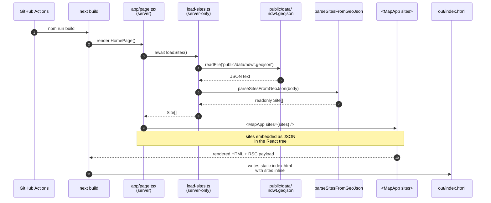
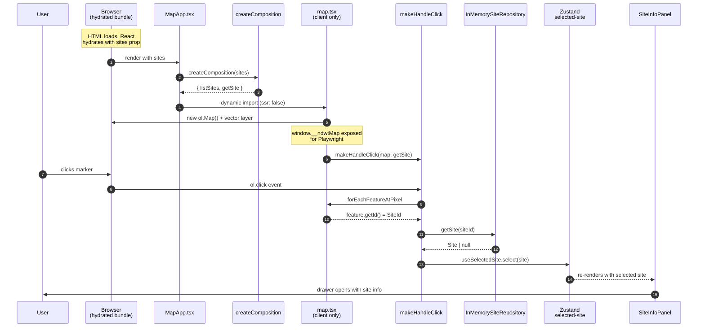

# Data flow

There are two distinct flows worth understanding: the **build-time
load** that bakes the trail data into the static export, and the
**runtime click** that opens the info panel for a selected marker.

## Build-time: GeoJSON → static HTML

**What this means in practice:**

- `npm run build` deterministically embeds the current GeoJSON
  into `out/index.html`. There is no runtime fetch of the dataset.
- A change to `public/data/ndwt.geojson` requires a rebuild
  (`npm run build` or a fresh deploy). Not a runtime concern.
- The same parser (`parseSitesFromGeoJson`) is used by the
  inbound/server loader and the outbound/client `GeoJsonSiteRepository`.
  Both produce identical `Site[]` shapes.

## Runtime: marker click → info panel

## Notable design decisions in this flow

- **`MapApp` builds a fresh composition per render** via `useMemo`
  on `sites`. There is **no module-level mutable state** — every
  click goes through the same per-render `getSite` closure.
  Removing the previous `hydrateSites(sites)` global was a
  concurrent-React safety fix (Phase 4 PR review).
- **`map.tsx` is dynamic-imported with `ssr: false`** because OL
  reads `window` at module init. Loading it on the server would
  crash the build.
- **Click handler is a pure curried function** in
  `src/components/map-handlers.ts`, unit-tested with a fake Map.
  The wrapper component `map.tsx` only owns the OL instance and
  the cleanup; logic stays testable.
- **Selected-site state is in Zustand**, not React state, because
  the click happens inside an OL event handler that doesn't have
  React context. Zustand's `getState()` works from anywhere.
- **The drawer is non-modal** (`Dialog.Root modal={false}`) so the
  map stays clickable while the panel is open. Different markers
  update the panel content in place.

## See also

- [`hexagonal.md`](./hexagonal.md) — the layer separation that
  makes this two-stage flow possible
- [`components.md`](./components.md) — which file each step lives
  in
- ADR [0001](../decisions/0001-nextjs-app-router.md) (static
  export) and [0003](../decisions/0003-hexagonal-architecture.md)
  (hex-arch) underpin the choice to bake data at build time
