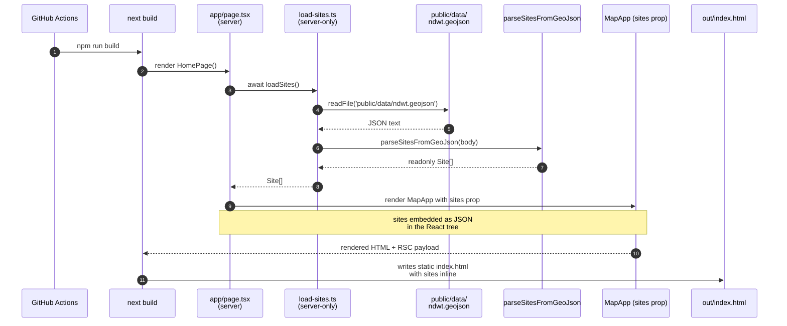
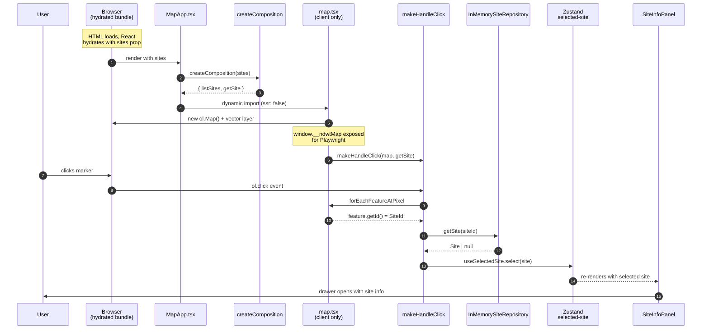
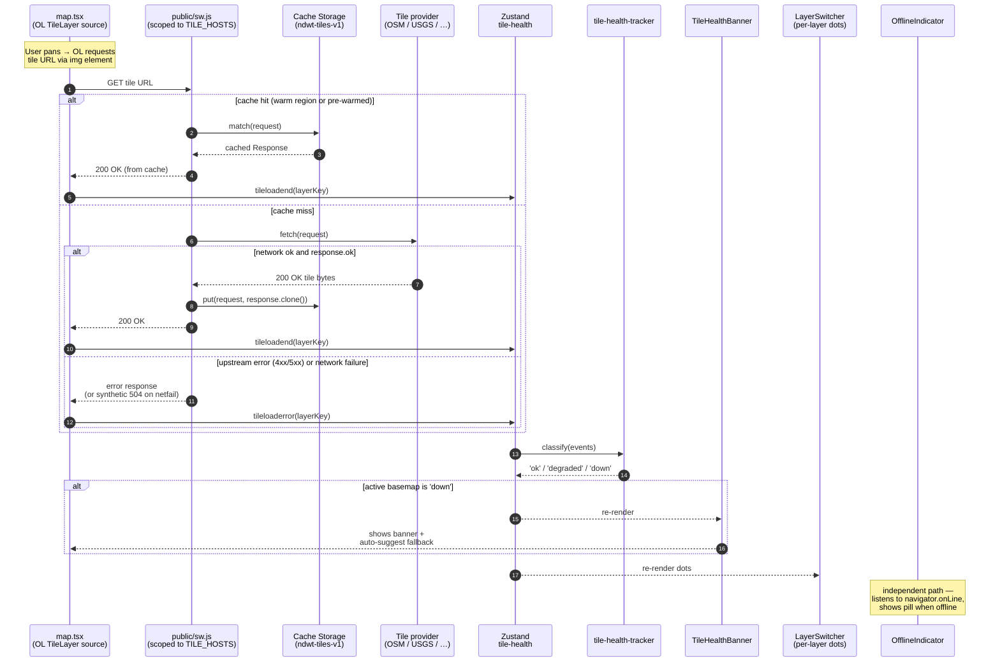

# Data flow

There are three flows worth understanding: the **build-time load**
that bakes the trail data into the static export, the **runtime
click** that opens the info panel for a selected marker, and the
**tile fetch with resilience** that the user actually exercises every
time they pan the map.

## Build-time: GeoJSON → static HTML

**What this means in practice:**

- `npm run build` deterministically embeds the current GeoJSON
  into `out/index.html`. There is no runtime fetch of the dataset.
- A change to `public/data/ndwt.geojson` requires a rebuild
  (`npm run build` or a fresh deploy). Not a runtime concern.
- The same parser (`parseSitesFromGeoJson`) is used by the
  inbound/server loader and the outbound/client `GeoJsonSiteRepository`.
  Both produce identical `Site[]` shapes.

## Runtime: marker click → info panel

## Runtime: tile fetch with resilience

Every pan, zoom, or basemap switch fires this loop. The service
worker intercepts the network round-trip and the tile-health store
tracks success/failure so the banner can suggest a healthy fallback
when an upstream provider goes flaky.

**What this means in practice:**

- **The SW lives outside React.** A route navigation or component
  remount doesn't drop the cache; the SW keeps working while the page
  reloads.
- **The classifier is pure.** Sticky-down latching (`downSince`,
  5-minute persistence) suppresses banner flapping when an outage is
  partial — a few sporadic successes won't immediately revert the
  classification to 'ok'.
- **The SW only intercepts the seven known tile hosts.** App bundles,
  GeoJSON, MDX content, and static assets all pass through to the
  browser's default handling. See ADR
  [0004](../decisions/0004-tile-resilience.md) for the full host
  list and the rationale.
- **The "Save current view for offline use" action in the settings
  drawer** (top-right gear icon) walks the visible tile layers,
  enumerates every (z, x, y) in the current viewport, and fetches
  each through the same SW. After the action completes the tile
  count in the drawer reflects the warmed cache.

## Notable design decisions in these flows

- **`MapApp` builds a fresh composition per render** via `useMemo`
  on `sites`. There is **no module-level mutable state** — every
  click goes through the same per-render `getSite` closure.
  Removing the previous `hydrateSites(sites)` global was a
  concurrent-React safety fix (Phase 4 PR review).
- **`map.tsx` is dynamic-imported with `ssr: false`** because OL
  reads `window` at module init. Loading it on the server would
  crash the build.
- **Click handler is a pure curried function** in
  `src/components/map-handlers.ts`, unit-tested with a fake Map.
  The wrapper component `map.tsx` only owns the OL instance and
  the cleanup; logic stays testable.
- **Selected-site state is in Zustand**, not React state, because
  the click happens inside an OL event handler that doesn't have
  React context. Zustand's `getState()` works from anywhere.
- **The drawer is non-modal** (`Dialog.Root modal={false}`) so the
  map stays clickable while the panel is open. Different markers
  update the panel content in place.

## See also

- [`hexagonal.md`](./hexagonal.md) — the layer separation that
  makes this two-stage flow possible
- [`components.md`](./components.md) — which file each step lives
  in
- ADR [0001](../decisions/0001-nextjs-app-router.md) (static
  export) and [0003](../decisions/0003-hexagonal-architecture.md)
  (hex-arch) underpin the choice to bake data at build time
- ADR [0004](../decisions/0004-tile-resilience.md) explains the
  tile resilience choices — pure classifier, raw SW, cache-first
  scoped to known hosts, sticky-down latching
