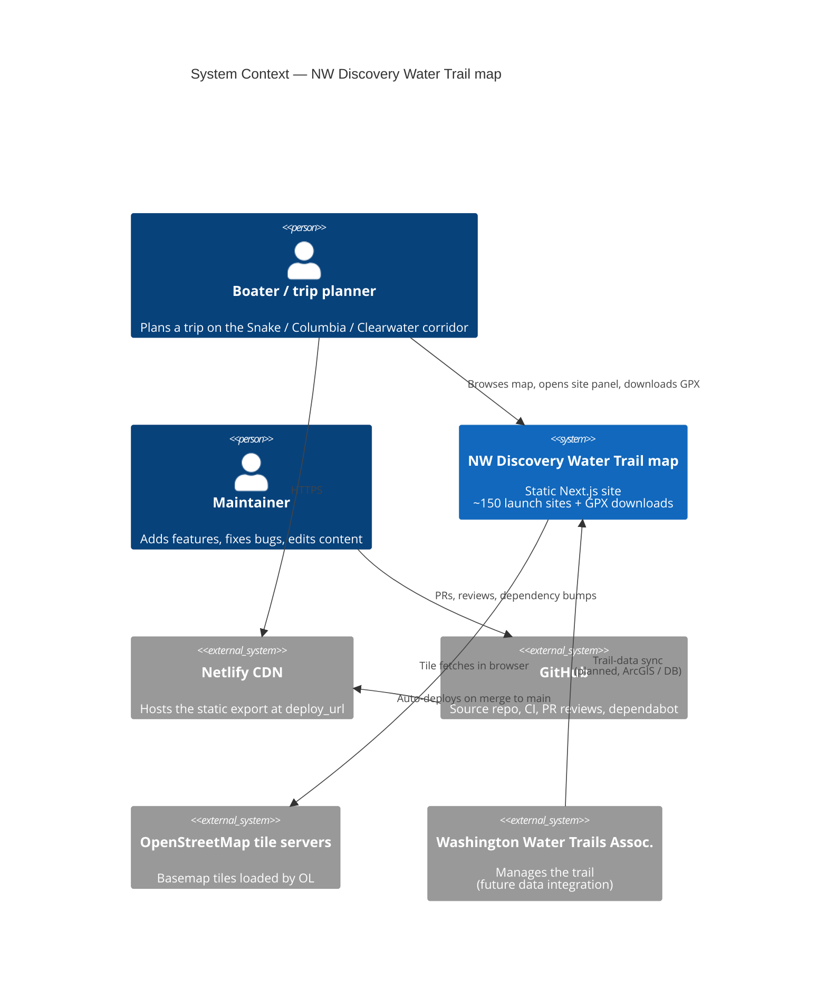

# System overview

C4 Context (level 1) and Container (level 2) views of the
Northwest Discovery Water Trail map site. Diagrams use
[MermaidJS](https://mermaid.js.org) and render directly on GitHub.

## Context

The whole product fits in one diagram: a public, browser-based
map. Source data is a static GeoJSON file we maintain in this
repository; the deployed site is a static export served by
Netlify's CDN.



## Container

The container view zooms into the deployable units. Notice that
**the only dynamic component is the user's browser** — Netlify
serves pre-rendered HTML and the trail data is baked into each
page at build time.

```mermaid
C4Container
  title Container — what runs where

  Person(boater, "Boater")

  System_Boundary(deploy, "Static deploy on Netlify") {
    Container(html, "Pre-rendered HTML", "Next.js static export", "/, /about/, /trip-planning/<br/>Site[] inlined into the page tree")
    Container(js, "Hydration bundle", "React 19 + OpenLayers 10", "Mounts the map after page load<br/>handles clicks + GPX download")
    Container(css, "Atomic CSS", "PandaCSS", "Generated at build time<br/>no runtime CSS-in-JS")
    Container(data, "/data/ndwt.geojson", "Static asset", "147 sites + facility flags<br/>still served for external GIS consumers")
  }

  System_Ext(github_actions, "GitHub Actions CI", "Lint / typecheck / Vitest / Playwright / SonarCloud / DeepSource on every PR")
  System_Ext(osm_tiles, "OSM tile servers", "Fetched on demand by the OL map")
  System_Ext(repo, "ivanoats/ndwt-ol-chakra", "Source of truth — public/data/ndwt.geojson")

  Rel(boater, html, "Loads")
  Rel(html, js, "Hydrates")
  Rel(js, osm_tiles, "Tile requests")
  Rel(repo, github_actions, "Push triggers")
  Rel(github_actions, deploy, "Static export → out/")

  UpdateRelStyle(html, js, $offsetY="-10")
```

## Why this shape

- **Static export** keeps hosting cheap and the deploy preview
  fast. No server runtime, no API routes, no cold starts.
- **Trail data baked in at build time** kills the runtime fetch
  hop and gives the map paint at first byte. The `/data/ndwt.geojson`
  file is still published unchanged so anyone running their own
  map / trip planner can ingest the dataset directly.
- **OL is the only meaningful client-side dependency** — the
  hydration bundle stays small because we don't ship a UI runtime
  (Park UI components compile to plain elements + atomic CSS).

## See also

- [`hexagonal.md`](./hexagonal.md) — how the source code is
  organized into ports and adapters
- [`data-flow.md`](./data-flow.md) — the build-time + runtime
  sequence that produces what's described above
- [`components.md`](./components.md) — module-level layout
