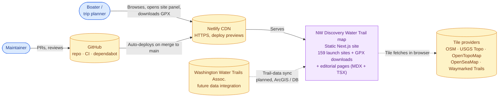
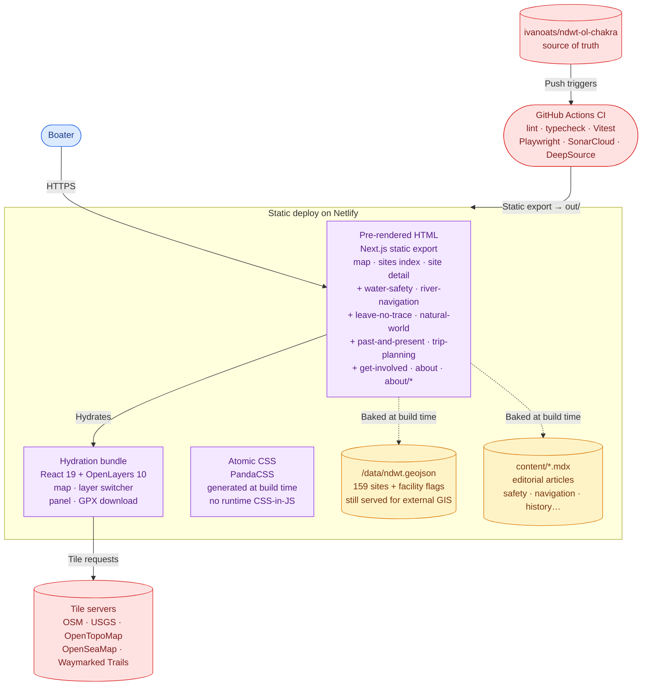

# System overview

C4 Context (level 1) and Container (level 2) views of the
Northwest Discovery Water Trail map site. Diagrams are written
as Mermaid `flowchart`s (the C4 plugin is unstable on GitHub's
renderer) and render directly on GitHub.

## Context

The whole product fits in one diagram: a public, browser-based
map plus a small set of editorial articles. Source data is a
static GeoJSON file we maintain in this repository plus MDX
content under `content/`; the deployed site is a static export
served by Netlify's CDN.

## Container

The container view zooms into the deployable units. Notice that
**the only dynamic component is the user's browser** — Netlify
serves pre-rendered HTML and the trail data + editorial articles
are baked into each page at build time.

## Why this shape

- **Static export** keeps hosting cheap and the deploy preview
  fast. No server runtime, no API routes, no cold starts.
- **Trail data baked in at build time** kills the runtime fetch
  hop and gives the map paint at first byte. The
  `/data/ndwt.geojson` file is still published unchanged so
  anyone running their own map / trip planner can ingest the
  dataset directly.
- **MDX content baked in too** — editorial articles ship as
  pre-rendered HTML; no MDX runtime in the client bundle.
- **Multiple tile providers, all client-fetched** — the map UI
  exposes a layer switcher so users can toggle between the
  OSM street basemap, USGS topo, and OpenTopoMap, and overlay
  OpenSeaMap sea marks or Waymarked Trails hiking. All tile
  fetches are direct from the browser to the provider; the
  static deploy never proxies them.
- **OL is the only meaningful client-side dependency** — the
  hydration bundle stays small because we don't ship a UI
  runtime (Park UI components compile to plain elements +
  atomic CSS).

## See also

- [`hexagonal.md`](./hexagonal.md) — how the source code is
  organized into ports and adapters
- [`data-flow.md`](./data-flow.md) — the build-time + runtime
  sequence that produces what's described above
- [`components.md`](./components.md) — module-level layout
